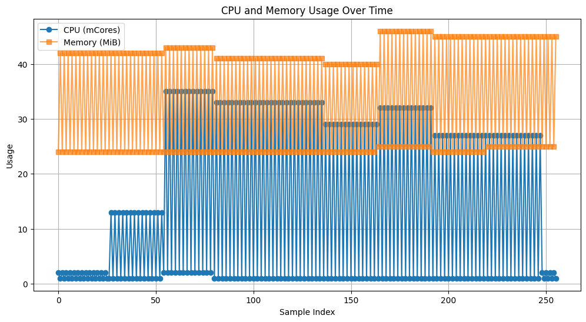
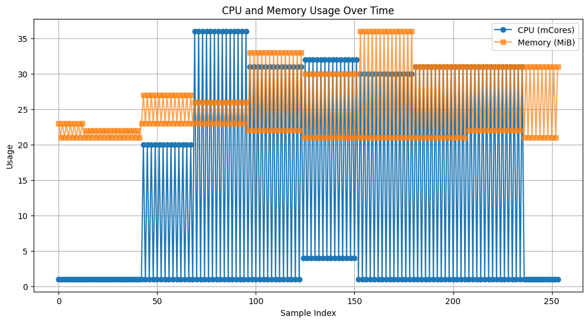

### 1. Command: kind create cluster
    - kubectl cluster-info --context kind-kind
       
### 2. kubectl create namespace julian
    - kubectl get namespaces
    - kubectl config set-context --current --namespace=julian
    - kubectl config view --minify | grep namespace:


### 3.  Command: kubectl apply -f deployment.yaml

```yaml
apiVersion: apps/v1
kind: Deployment
metadata:
name: julian
labels:
    created-by: julian
spec:
replicas: 1
selector:
    matchLabels:
    app: julian
template:
    metadata:
    labels:
        app: julian
        created-by: julian
    spec:
    containers:
        - name: http-https-echo
        image: mendhak/http-https-echo
        env:
            - name: ECHO_INCLUDE_ENV_VARS
            value: "1"
        livenessProbe:
            httpGet:
            path: /
            port: 8080
            initialDelaySeconds: 5
            periodSeconds: 10
        readinessProbe:
            httpGet:
            path: /
            port: 8080
            initialDelaySeconds: 5
            periodSeconds: 10
```

- kubectl get deployments
```
NAME     READY   UP-TO-DATE   AVAILABLE   AGE
julian   0/1     1            0           23s
```
- kubectl get pods
```
NAME                     READY   STATUS    RESTARTS   AGE
julian-8848cd65b-qnj52   0/1     Running   0          4s 
```

   
### 4.  kubectl apply -f https://github.com/kubernetes-sigs/metrics-server/releases/download/v0.5.0/components.yaml

- kubectl get pods -n kube-system
```
NAME                                         READY   STATUS    RESTARTS      AGE
coredns-7c65d6cfc9-rm8l8                     1/1     Running   1 (11m ago)   3h59m
coredns-7c65d6cfc9-wj44m                     1/1     Running   1 (11m ago)   3h59m
etcd-kind-control-plane                      1/1     Running   1 (11m ago)   3h59m
kindnet-vp55g                                1/1     Running   1 (11m ago)   3h59m
kube-apiserver-kind-control-plane            1/1     Running   1 (11m ago)   3h59m
kube-controller-manager-kind-control-plane   1/1     Running   1 (11m ago)   3h59m
kube-proxy-l2fcx                             1/1     Running   1 (11m ago)   3h59m
kube-scheduler-kind-control-plane            1/1     Running   1 (11m ago)   3h59m
metrics-server-bc86b778d-lp8bl               0/1     Running   0             21s
```

- kubectl patch -n kube-system deployment metrics-server --type=json -p '[{"op":"add","path":"/spec/template/spec/containers/0/args/-","value":"--kubelet-insecure-tls"}]'
- kubectl get deployment metrics-server -n kube-system

```
NAME             READY   UP-TO-DATE   AVAILABLE   AGE
metrics-server   1/1     1            1           2m23s
```

### 5. kubectl top pod
```
NAME                      CPU(cores)   MEMORY(bytes)   
julian-5996d97c48-b5cpx   1m           21Mi     
```
- New deployment
```yaml
apiVersion: apps/v1
kind: Deployment
metadata:
name: julian
labels:
    created-by: julian
spec:
replicas: 1
selector:
    matchLabels:
    app: julian
template:
    metadata:
    labels:
        app: julian
        created-by: julian
    spec:
    containers:
        - name: http-https-echo
        image: mendhak/http-https-echo
        env:
            - name: ECHO_INCLUDE_ENV_VARS
            value: "1"
        livenessProbe:
            httpGet:
            path: /
            port: 8080
            initialDelaySeconds: 15
            periodSeconds: 10
        readinessProbe:
            httpGet:
            path: /
            port: 8080
            initialDelaySeconds: 15
            periodSeconds: 10
        resources:
            requests:
            memory: "21Mi"
            cpu: "1m"
            limits:
            memory: "32Mi"
            cpu: "10m"

```


#### Warum diese Werte?
Ich habe bewusst mal sehr geringe Werte verwendet um zu schauen was passiert. Mit diesen Werten stürzt der Pod immerwieder ab weil die Last zu hoch ist, deswegen habe ich die Werte aus der Vorlesung verwendet.


- kubectl apply -f deployment.yaml  


```yaml
resources:
requests:
    memory: "64Mi"
    cpu: "20m"
limits: 
    cpu: "1"
    memory: "64Mi" 
```

Requests:
- CPU: 20m (20 Milli-CPU oder 0,02 CPU-Kerne) – 
    - Das ist die garantierte Mindest-CPU-Zuweisung für einen Pod. Der Pod hat Anspruch auf mindestens 20 milliCPUs.
    - Speicher: 64Mi – Dem Pod werden mindestens 64 MiB Speicher garantiert.
- limits:
    - CPU: 1 (1 voller CPU-Kern): Das ist die maximale CPU, die ein Pod verwenden kann. Kubernetes drosselt den Pod, wenn er versucht, dieses Limit zu überschreiten.
    - Speicher: 64Mi: Das ist der maximale Speicher, den ein Pod verwenden kann. Wenn er versucht, mehr als diesen Wert zu verwenden, beendet Kubernetes den Pod mit einem Out of Memory (OOM)-Fehler.


### 6. Two replicas
```yaml
...
spec:
    replicas: 2
...
```
- kubectl get deployments
```
NAME     READY   UP-TO-DATE   AVAILABLE   AGE
julian   2/2     2            2           4h10m
```


- kubectl get pods

```
NAME                      READY   STATUS    RESTARTS   AGE
julian-84975c8ddf-4vh2l   1/1     Running   0          2m27s
julian-84975c8ddf-jvkr8   1/1     Running   0          9m22s
```

### 7. kubectl apply -f service.yaml
    service.yaml
    ```yaml
    apiVersion: v1
    kind: Service
    metadata:
    name: julian
    labels:
        created-by: julian
    spec:
    selector:
        app: julian
    ports:
        - protocol: TCP
        port: 8000      
        targetPort: 8080 
    type: ClusterIP

    ```
- kubectl get svc
    ```
    NAME     TYPE        CLUSTER-IP     EXTERNAL-IP   PORT(S)    AGE
    julian   ClusterIP   10.96.215.24   <none>        8000/TCP   84s
    ```
### 8. kubectl port-forward svc/julian 8000:8000
- curl http://localhost:8000
```
{
  "path": "/",
  "headers": {
    "host": "localhost:8000",
    "user-agent": "curl/8.4.0",
    "accept": "*/*"
  },
  "method": "GET",
  "body": "",
  "fresh": false,
  "hostname": "localhost",
  "ip": "::ffff:127.0.0.1",
  "ips": [],
  "protocol": "http",
  "query": {},
  "subdomains": [],
  "xhr": false,
  "os": {
    "hostname": "julian-84975c8ddf-jvkr8"
  },
  "connection": {},
  "env": {
    "KUBERNETES_PORT": "tcp://10.96.0.1:443",
    "KUBERNETES_SERVICE_PORT": "443",
    "NODE_VERSION": "18.20.4",
    "HOSTNAME": "julian-84975c8ddf-jvkr8",
    "YARN_VERSION": "1.22.19",
    "SHLVL": "1",
    "HOME": "/home/node",
    "ECHO_INCLUDE_ENV_VARS": "1",
    "KUBERNETES_PORT_443_TCP_ADDR": "10.96.0.1",
    "HTTP_PORT": "8080",
    "PATH": "/usr/local/sbin:/usr/local/bin:/usr/sbin:/usr/bin:/sbin:/bin",
    "KUBERNETES_PORT_443_TCP_PORT": "443",
    "KUBERNETES_PORT_443_TCP_PROTO": "tcp",
    "HTTPS_PORT": "8443",
    "KUBERNETES_PORT_443_TCP": "tcp://10.96.0.1:443",
    "KUBERNETES_SERVICE_PORT_HTTPS": "443",
    "KUBERNETES_SERVICE_HOST": "10.96.0.1",
    "PWD": "/app"
  }
}%
```

### 9. Es gibt kein "--watch" beim "top pod" Befehl, deswegen habe ich es schreibe ich jede Sekunde die aktuellen Werte von top pod in die Datei kubectl_top_output.txt: 
``` 
while true; do kubectl top pod -n julian >> kubectl_top_output.txt; sleep 1; done
```
Es soll insgesamt mindestens eine Minute dauern, deswegen mache ich den Request 1000 mal jeweils nach 0.06 Sekunden:
```
for i in {1..1000}; do
    curl -s http://localhost:8000 > /dev/null
    sleep 0.06 
done
```
Ein Beispielergebnis:
```
NAME                      CPU(cores)   MEMORY(bytes)   
julian-5df6fc4769-prm82   2m           24Mi            
julian-5df6fc4769-w2cvm   35m          43Mi   
```



Memory: Die beobachtete Speichernutzung (35 MiB) liegt deutlich innerhalb der Anforderung und des Grenzwerts von 64 MiB, sodass die Anwendung über genügend Speicher verfügt, um problemlos zu funktionieren. Man könnte über eine Reduzierung der "memory allocation" (z. B. auf 40 MiB) nachdenken, was die Ressourceneffizienz verbessern würde.

- Neues Deployment:
```yaml
resources:
    requests:
        memory: "40Mi" 
        cpu: "20m"     
    limits:
        memory: "64Mi" 
        cpu: "250m"    
```
### Erklärung der Anpassung
#### Memory Requests:

Auf 40 Mi festgelegt, was etwas über der beobachteten maximalen Speichernutzung von 35 MiB liegt.
Stellt sicher, dass der Pod genügend garantierten Speicher vom Node erhält, um zuverlässig und ohne Konflikte zu funktionieren.

#### Memory Limits:

Bleibt bei 64 Mi, um gelegentliche Spitzen über der maximal beobachteten Nutzung hinaus zuzulassen und OOM-Fehler während vorübergehender Spitzen zu verhindern.
Ermöglicht dem Container, die angeforderte Menge zu überschreiten, während der Node vor Speichererschöpfung geschützt wird.

#### CPU Requests:

Auf 20 m belassen, basierend auf Ihrer anfänglichen Konfiguration, da die CPU-Nutzung für die OOM-Verhinderung normalerweise weniger kritisch ist als der Speicher.

#### CPU Limits:

Bei 250m, um potenzielle "processing spikes" zu bewältigen und sicherzustellen, dass der Pod bei höherer Belastung nicht übermäßig gedrosselt wird.



### Cleanup
```
kind delete cluster
```